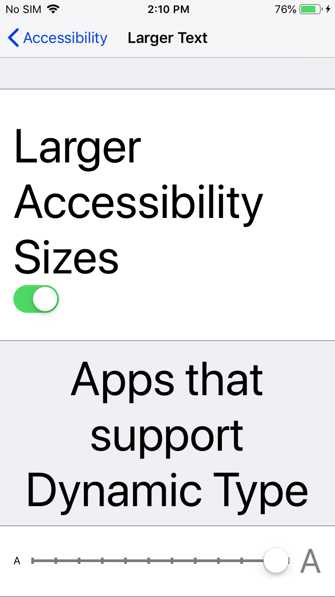

## Label Rendering Bug Repo
Xamarin Forms Version: 5.0.0.1874  (has been seen in previous versions too)
Device: iPhone 6 (Model: A1586)

**Note:** Issue has been seen on Android and iOS devices in many varying cases when using font scaling. This has proven to be a reoccuring issue with apps that must be designed for accessibility. Specifically, this was original found in a medical app during development that must support a very large set of Accessibility features due to industry requirements.

**Issue:** Is certain circumstances, Xamarin forms Labels cut off text that is being font scaled on the system. This is reproducible on Android and iOS in very specific circumstances. This was most easily reproducible on iOS and is what is screenshotted below. The issue was easiest to reproduce when adding Padding to a label which used named sizes. The issue is consistently reproduced when font scaled using the repo here on the device specificed with the font scaling set to the imaged setting shown.

**Code:** Here is the XAML that creates the issue
```
<Frame>
    <Label Grid.Row="0" Grid.Column="0"
            Padding="22,0,0,0" FontSize="Small"
            Text="This label is a long title that takes up many lines and gets cut off at random places."/>
</Frame>
```

**Repo Screenshot from physical iPhone 6 device:**

The text shown below cuts off the text "places." at the end when it should not. The font scaling is set all the way up to max.


